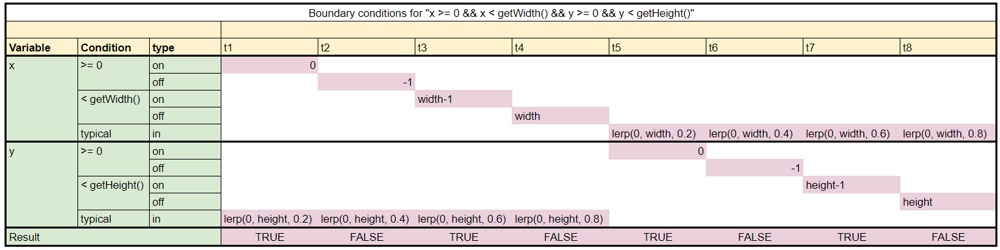
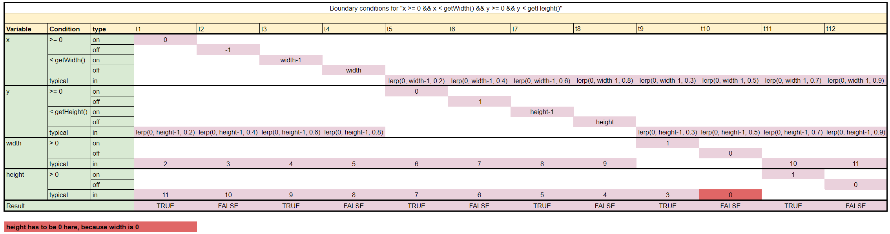

# Exercise 6

### *"Name 2 classes that are not well-tested, and explain why the smoke test does not cover it."*

The classes `CollisionInteractionMap` and `InverseCollisionHandler` have 0% Class-coverage, because they are indirectly unused.  
Their only usage is in the `DefaultPlayerInteractionMap`, a class that isn't used by any code. (consequently the Class-coverage of this class is 0% as well)  

The SmokeTest would cover all 3 of these classes, if it instantiated the `DefaultPlayerInteractionMap` directly or indirectly.

<br/>

# Exercise 8

### *"Change board.Direction.getDeltaX so that it returns dy instead of dx."*
### *"Explain what you see. Was it easy to understand where the problem is?"*

The test fails with this message:
```
org.opentest4j.AssertionFailedError: 
Expecting:
 <0>
to be equal to:
 <10>
but was not.
Expected :10
Actual   :0

at nl.tudelft.jpacman.LauncherSmokeTest.smokeTest(LauncherSmokeTest.java:69)
```

In my opinion, the message provided by the smoke test isn't very clear. And the information that this test is failing is not particularly helpful.  
This is because there are many possible error sources, as the test simply does "take one step east, are your points == 10?", it may be that the point calculator does not work, the level is set up incorrectly, something about the movement is broken, etc.

However, it is absolutely fine, that the smoke test provides such a general error, since it's purpose is to identify "does the game seem to work at a general level?" - and it correctly identified that it does *not*.

If we execute all test cases, it is easy to identify that something about navigating the board does not work correctly.  
Unfortunately gradle does not execute our `DirectionTest` class, which makes the issue strikingly obvious, because the `DirectionTest` is not part of the `default-test`s.

<br/>

# Exercise 12

### *"Provide a domain matrix for the desired behavior of the boundary values in the withinBorders method."*



**Further Considerations:**  
`Width` and `Height` are variables as well from the set of positive natural numbers (including `0`).  
We should test these boundaries ("`Width = 0`" and/or "`Height = 0`") as well, however, given the structure of two-dimensional Arrays, we cannot test for "`Width = 0 && Height > 0`".

Furthermore, assuming a `Width` of `0` reveals an inadequacy with the `Board` class, since `getHeight` will throw an exception.

Our resulting domain matrix may look like this:  
