# Exercise 20

*see added test class `MapParserTest`*  
*or alternatively the relevant [Merge Request](https://github.com/BlazingTwist/SoftwareTesting_LabWork/pull/24)*

|"Nice Weather"-Test|Method under Test|Summary|
|:---|:---|:---|
|test_parseMap_normalMap|parseMap(char[][] map)|Provides a typical Map and verifies that the Tiles `empty`, `wall`, `pellet` and `ghost` are created correctly.|
|test_parseMap_validPlayerPosition|parseMap(char[][] map)|Provides a typical Map and verifies that the Player is correctly placed in the world.|
|test_parseMap_validStringList|parseMap(List<String> text)|Verify that the overload is working as expected.|
|test_parseMap_validInputStream|parseMap(InputStream source)|Verify that the overload is working as expected.|
|test_parseMap_validMapName|parseMap(String mapName)|Verify that the overload is working as expected.|

# Exercise 21

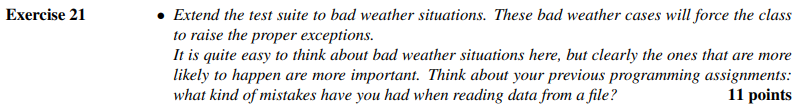

*see added test class `MapParserTest`*  
*or alternatively the relevant [Merge Request](https://github.com/BlazingTwist/SoftwareTesting_LabWork/pull/24)*

|"Bad Weather"-Test|Method under Test|Summary|
|:---|:---|:---|
|test_parseMap_emptyMap|parseMap(char[][] map)|Provides a completely empty map and verifies that it is handles correctly.|
|test_parseMap_invalidCharacter|parseMap(char[][] map)|Verify that an exception is thrown when maps contain unknown characters.|
|test_parseMap_invalidFormat|parseMap(List<String> text)|Verify that invalidly formatted maps raise an exception.|
|test_parseMap_invalidMapName|parseMap(String mapName)|Verify that trying to parse a map that does not exist raises an exception.|
|test_parseMap_throwsIOException|parseMap(String mapName)|Verify behaviour of parseMap, when the InputStream overload throws an exception.|

# Exercise 22

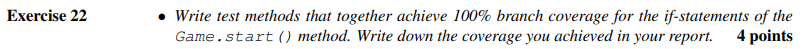

*see added test class `GameTest`*  
*or alternatively the relevant [Merge Request](https://github.com/BlazingTwist/SoftwareTesting_LabWork/pull/26)*

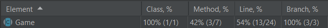

 

# Exercise 23

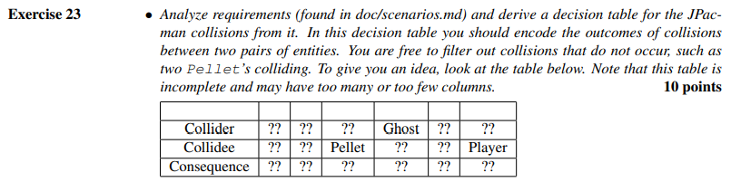

|Collider|Collidee|Consequence|
|--------|--------|-----------|
| Player | empty Square | points stay the same           |
| Player | Wall         | move is not conducted          |
| Player | Player       | players occupy the same square |
| Player | Pellet       | earn Points, Pellet disappears |
| Player | Ghost        | Pacman dies, Game over         |
| Ghost  | emptySquare  | ghost occupies empty square    |
| Ghost  | Wall         | move is not conducted          |
| Ghost  | Player       | Game over                      |
| Ghost  | Pellet       | Pellet isn´t visible anymore   |
| Ghost  | Ghost        | ghosts occupy the same square  |

# Exercise 24

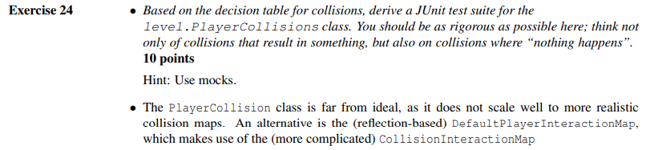

*see added test class `PlayerCollisionsTest`*  
*or alternatively the relevant [Merge Request](https://github.com/BlazingTwist/SoftwareTesting_LabWork/pull/27)*

 

# Exercise 25

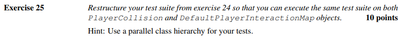

*see modified test class `PlayerCollisionsTest`*  
*or alternatively the relevant [Merge Request](https://github.com/BlazingTwist/SoftwareTesting_LabWork/pull/28)*

# Exercise 26

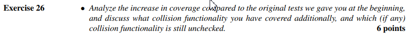

Coverage before:
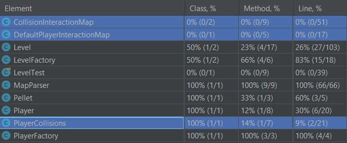

Coverage after:
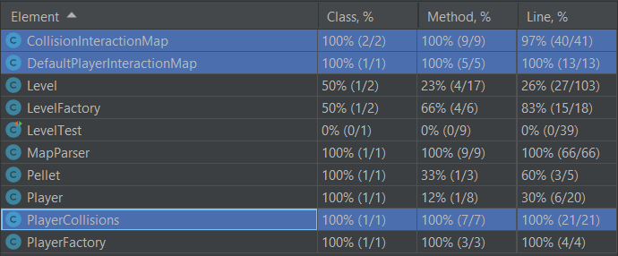

The remaining uncovered line in `CollisionInteractionMap`
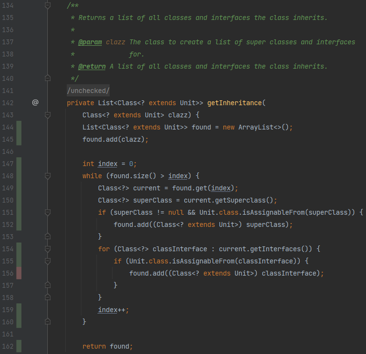

The added `PlayerCollisionsTest` supports testing Classes that implement the `CollisionMap` interface *and* make use of a `PointCalculator`.  
It exercises all scenarios described in Exercise_23, except for those that do not involve `Unit`s ("empty Square" and "Wall").  
Currently collisions between Units that are assumed to be stationary are not checked (e.g. Pellet on Pellet).

# Exercise 27

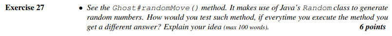

In this case I would test that one of the possible results of this method is present as the return value of this function.  
Currently, the `randomMove()` method creates a new Random Number Generator every time it is called - that smells! Instead it should obtain a new random number from an existing generator.  
If that was the case, it would also mean that we can mock the generator and eliminate the randomness in our tests.

 

# Exercise 28

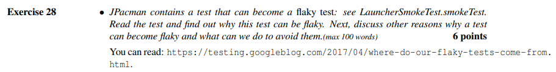

The smoke test only works in the current level. In another level it may fail. In addition, it can also fail if something is changed in the "attack" algorithms of the ghosts. The likelihood of flaky tests increases with the size of our tests. The larger it is, the flakier it can be. We can reduce this by considering beforehand what we want to test in order to avoid unnecessary tests and thus to keep the tests smaller.

 

# Exercise 29

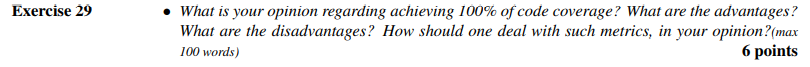

100% code coverage is a nice thing, but in most cases it is not necessary or not realistic.  
The advantage is that you can be sure that the code does what you expect.  
The disadvantage is that you usually need a lot of resources to achieve 100% code coverage.  
Such metrics are good for assessing how error-free the code is. For core elements of the code, you should achieve a very high percentage of the metrics, but for less important elements, in my opinion, 80% is enough.

# Exercise 30

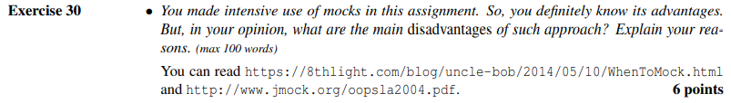

I see three possible disadvantages with mocking:
1. Performance - Mocking makes use of reflection, which *can* be slower than the classes that are being mocked.
2. Refactoring - From what I've seen, mocking can get closely coupled to the class that is being mocked. That means that seemingly simple refactoring could lead to a long string of Tests that need to be updated.
3. Bugs obscured by mocking - typically, getters are only indirectly tested (because "it's a getter, what could go wrong here"), but if every test is mocking this getter, we never ensure that the getter actually works at all.

 

# Exercise 31

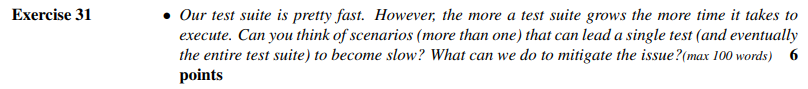

Unit Tests may become slow when the unit that is being tested involves too many dependencies.  
We can solve this issue by using Mocks and/or limiting our tests to only exercise the behaviour of the Unit under test.

Complex tests can also slow down the Test Suite.  
Here we should identify what exactly is being tested and reducing the test accordingly.

Lastly, The Test Suite may become slow if there are too many tests / the setup of tests is too complex.  
Since the setup will be executed once for every test, the effort spent on executing setup scales proportionally with the amount of tests.  
There is not much we can do to fix this, but one possibility is to identify the exact requirements of each test and minimizing the setup-code accordingly.

# Exercise 32

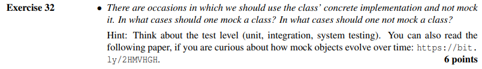

In my opinion, if the desired behaviour can easily be achieved without mocking (just using the concrete implementation), then that class should not be mocked.  
Conversely, the class probably should be mocked, if the desired behaviour is difficult to cause normally (e.g. testing anomalous behaviour).

In regards to test levels, I would argue that Mocking has no place in System Testing, as the goal is to verify the System as a whole.  
In Integration Testing, Mocking can be reasonable, but should be limited to the Modules that are not exercised by the Test.  
For example: if testing the communication between Module-A and Module-B requires the presence of Module-C which is *not* intended to be under test, then Mocking Module-C is reasonable.