# Students

* Eric Jarosch - 227271
* Lukas Fritzsche - 227771

 

# Exercise 33

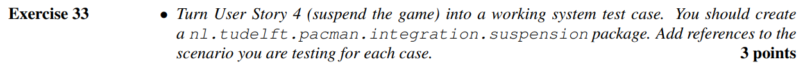

*see added test class `SuspensionTest`*  
*or alternatively the relevant [Merge Request](https://github.com/BlazingTwist/SoftwareTesting_LabWork/pull/30)*

Essentially, this test covers three cases:
* Initial start allows movement of units
* Suspension after initial start disallows movement of units
* Restart after suspension allows movement of units

 

# Exercise 34

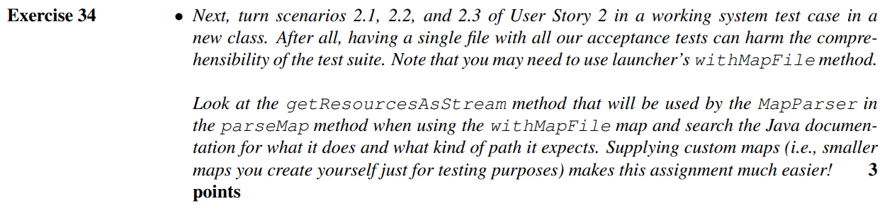

*see added test class `PlayerMovementTest`*  
*or alternatively the relevant [Merge Request](https://github.com/BlazingTwist/SoftwareTesting_LabWork/pull/31)*

 

# Exercise 35

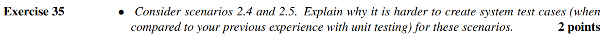

Scenario 2.4 and 2.5 are mostly quite similar to Unit-Testing, since there are decently powerful interfaces to control the player. (In a way, it is also "easier" than Unit-Testing, since the System manages a large chunk of initialization for us)

However, 2.4 and 2.5 have the added difficulty that we cannot directly observe whether Player::setAlive or Level::levelLost has been called.  
What we have to do instead, is to observe the attributes of the Level to identify what happened (e.g. "no pellets left" -> won | or "all players dead" -> lost)  
Alternatively we can register a LevelObserver to listen to levelWon and levelLost.

2.4 provides additional difficulty, since the Ghosts might move if the thread executing the test is too slow. This could result in flaky tests.

 

# Exercise 36

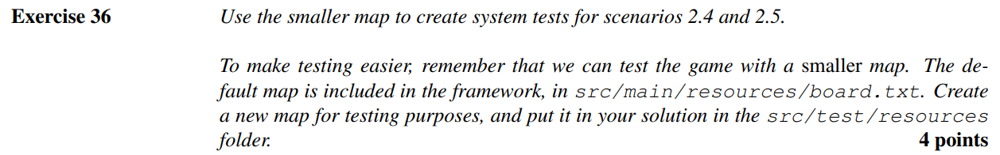

*see modified test class `PlayerMovementTest`*  
*or alternatively the relevant [Merge Request](https://github.com/BlazingTwist/SoftwareTesting_LabWork/pull/35)*

 

# Exercise 37

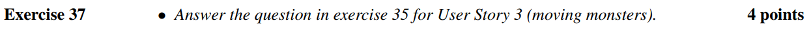

TODO

 

# Exercise 38

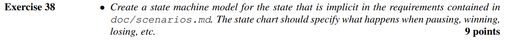

TODO

 

# Exercise 39

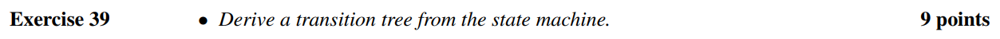

TODO

 

# Exercise 40

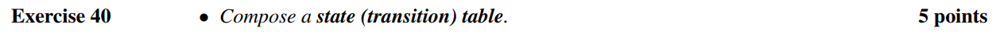

TODO

 

# Exercise 41

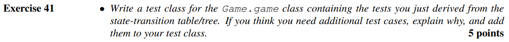

TODO

 

# Exercise 42

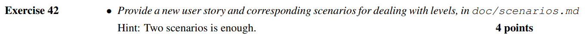

TODO

 

# Exercise 43

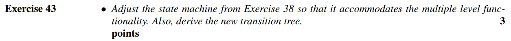

TODO

 

# Exercise 44

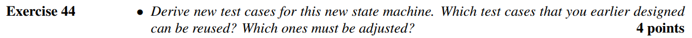

TODO

 

# Exercise 45

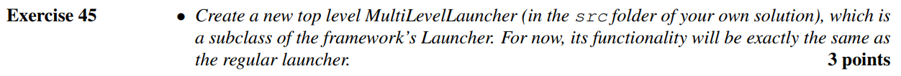

TODO

 

# Exercise 46

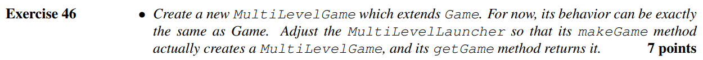

TODO

 

# Exercise 47

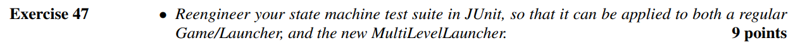

TODO

 

# Exercise 48

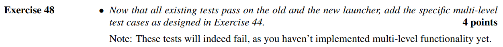

TODO

 

# Exercise 49

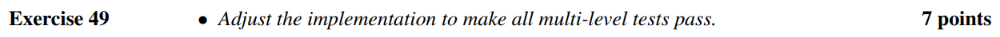

TODO

 

# Exercise 50

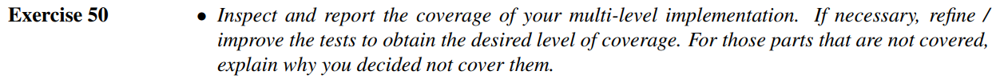

TODO

 

# Exercise 51

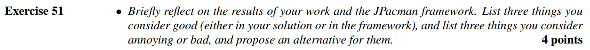

TODO